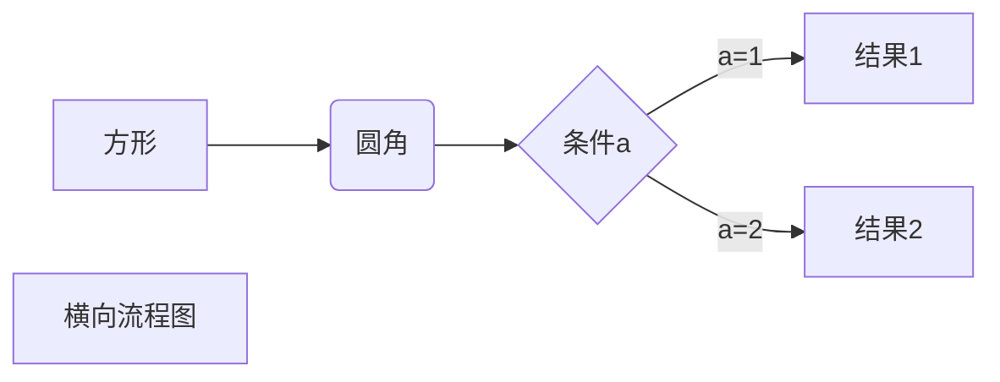
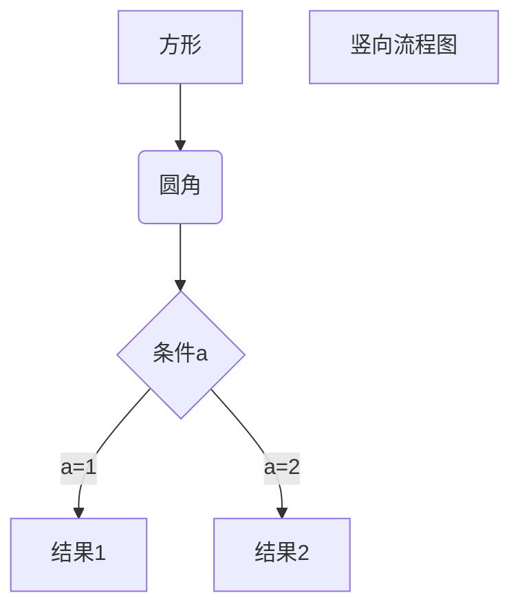
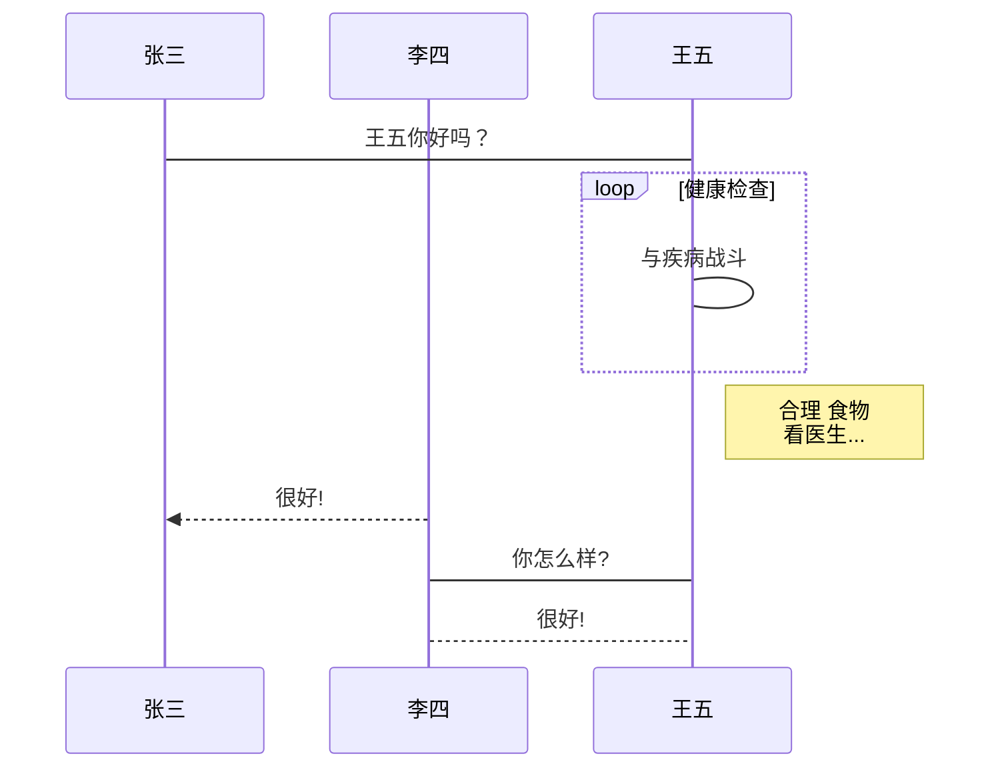
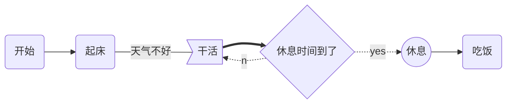
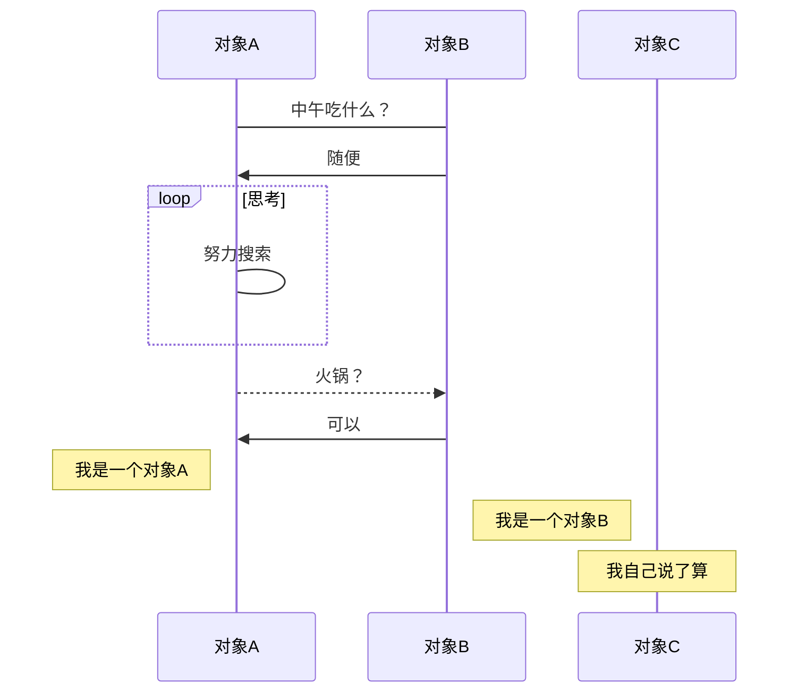
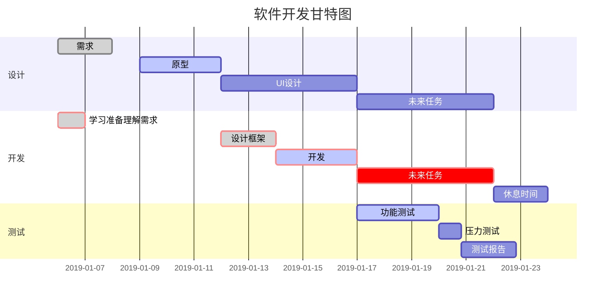

以下几个实例效果图如下：

1、横向流程图源码格式：



2、竖向流程图源码格式：



3、标准流程图源码格式：

```flow
st=>start: 开始框
op=>operation: 处理框
cond=>condition: 判断框(是或否?)
sub1=>subroutine: 子流程
io=>inputoutput: 输入输出框
e=>end: 结束框
st->op->cond
cond(yes)->io->e
cond(no)->sub1(right)->op
```

4、标准流程图源码格式（横向）：

```flow
st=>start: 开始框
op=>operation: 处理框
cond=>condition: 判断框(是或否?)
sub1=>subroutine: 子流程
io=>inputoutput: 输入输出框
e=>end: 结束框
st(right)->op(right)->cond
cond(yes)->io(bottom)->e
cond(no)->sub1(right)->op
```

5、UML时序图源码样例：

```sequence
对象A->对象B: 对象B你好吗?（请求）
Note right of 对象B: 对象B的描述
Note left of 对象A: 对象A的描述(提示)
对象B-->对象A: 我很好(响应)
对象A->对象B: 你真的好吗？
```

6、UML时序图源码复杂样例：

```sequence
Title: 标题：复杂使用
对象A->对象B: 对象B你好吗?（请求）
Note right of 对象B: 对象B的描述
Note left of 对象A: 对象A的描述(提示)
对象B-->对象A: 我很好(响应)
对象B->小三: 你好吗
小三-->>对象A: 对象B找我了
对象A->对象B: 你真的好吗？
Note over 小三,对象B: 我们是朋友
participant C
Note right of C: 没人陪我玩
```

7、UML标准时序图样例：



8、甘特图样例：


```mermaid
gantt
dateFormat  YYYY-MM-DD
title Shop项目交付计划

section 里程碑 0.1 
数据库设计          :active,    p1, 2016-08-15, 3d
详细设计            :           p2, after p1, 2d

section 里程碑 0.2
后端开发            :           p3, 2016-08-22, 20d
前端开发            :           p4, 2016-08-22, 15d

section 里程碑 0.3
功能测试            :       p6, after p3, 5d
上线               :       p7, after p6, 2d
交付               :       p8, afterp7, 2d
```

```
    title 图名
    dateFormat 日期格式
    section 部分名
    任务名:参数一, 参数二, 参数三, 参数四，参数五

  //参数一：crit 或者 不填
  //参数二：done、active 或者 不填
  //参数三：取别名 或者 不填
  //参数四：任务开始时间
  //参数五：任务结束时间
```

```
mermaid：图中红框第一行内容与最后一行内容，表示当前使用的语言为mermaid。
gantt：表示图表类型为甘特图
dateFormat：指定日期格式（Y表示年，M表示月，D表示日）。YYYY-MM-DD（2019-03-14），YY-MM-DD(19-03-14)
section： 项目关键字，空格之后输入项目名称。
任务行： section后每一行为一个任务。第一个字符串为任务名称，之后以:开头，添加任务属性。

接下来用下面代码实例说明常见任务属性。
任务状态：

    done 已完成
    active正在进行
    crit 关键任务
    默认任务都为待完成状态

任务描述：在des1、des2位置添加任务描述，其它任务引用时直接引用des1就可以。
after: 描述任务时间关系。des3, after des2表示des3紧跟在des2之后。
任务时长有三种方式：

    时间范围 如：2014-01-06,2014-01-08
    指定天数 如：5d
    指定开始日期+天数 如：2014-01-06，5d

**PS:所有关键字之间用“,”分隔，关键字需要属性时用空格分隔(如：after des2,)。
```


---


这些复杂图形的绘制都是使用代码块实现的，指定代码块的解析语言，按照响应的绘制语法即可实现。

- 流程图——指定 `mermaid`（样式流程图） 或 `flow` （标准流程图）解析语言
- 时序图——指定 `sequence`（标准时序图） 或 `mermaid`（样式时序图） 解析语言
- 甘特图——指定 `mermaid` 解析语言

#### 一、流程图

##### 1. 样式流程图

基本语法：

-  `graph` 指定流程图方向：`graph LR` 横向，`graph TD` 纵向
- 元素的形状定义：     
  -  `id[描述]` 以直角矩形绘制
  -  `id(描述)` 以圆角矩形绘制
  -  `id{描述}` 以菱形绘制
  -  `id>描述]` 以不对称矩形绘制
  -  `id((描述))` 以圆形绘制
- 线条定义：     
  -  `A-->B` 带箭头指向
  -  `A---B` 不带箭头连接
  -  `A-.-B` 虚线连接
  -  `A-.->B` 虚线指向
  -  `A==>B` 加粗箭头指向
  -  `A--描述---B` 不带箭头指向并在线段中间添加描述
  -  `A--描述-->B` 带描述的箭头指向
  -  `A-.描述.->B` 带描述的虚线连指向
  -  `A==描述==>B` 带描述的加粗箭头指向
- 子流程图定义：

```
subgraph title
    graph direction
end
123123
```

**示例：**


 

​    样式流程图   

##### 2. 标准流程图

基本语法：

- 定义模块 `id=>关键字: 描述` （“描述”的前面必须有空格，“=>” 两端不能有空格）
- 关键字：
  -  `start` 流程开始，以圆角矩形绘制
  -  `opearation` 操作，以直角矩形绘制
  -  `condition` 判断，以菱形绘制
  -  `subroutine` 子流程，以左右带空白框的矩形绘制
  -  `inputoutput` 输入输出，以平行四边形绘制
  -  `end` 流程结束，以圆角矩形绘制
- 定义模块间的流向：
  -  `模块1 id->模块2 id` ：一般的箭头指向
  -  `条件模块id (描述)->模块id(direction)` ：条件模块跳转到对应的执行模块，并指定对应分支的布局方向

**示例：**

```mermaid
flowchat
st=>start: 开始
ipt=>inputoutput: 输入一个x
op=>operation: 处理加工x+1
cond=>condition: 溢出（是或否？）
sub=>subroutine: 子流程
io=>inputoutput: 输出x
ed=>end: 结束
```
st->ipt->op->cond
 cond(yes)->io->ed
 cond(no)->sub->io->ed

     

  标准流程图 

#### 二、 时序图

##### 1. 标准时序图

基本语法：

-  `Title:标题` ：指定时序图的标题

-  `Note direction of 对象:描述` ： 在对象的某一侧添加描述，`direction` 可以为 `right/left/over` ， `对象` 可以是多个对象，以 `,` 作为分隔符

-  `participant 对象` ：创建一个对象

-  `loop...end` ：创建一个循环体

- ```
  对象A->对象B:描述
  ```

   ： 绘制A与B之间的对话，以实线连接   

  -  `->` 实线实心箭头指向
  -  `-->` 虚线实心箭头指向
  -  `->>` 实线小箭头指向
  -  `-->>` 虚线小箭头指向

**示例：**

```sequence
Title:时序图示例
客户端->服务端: 我想找你拿下数据 SYN
服务端-->客户端: 我收到你的请求啦 ACK+SYN
客户端->>服务端: 我收到你的确认啦，我们开始通信吧 ACK
Note right of 服务端: 我是一个服务端
Note left of 客户端: 我是一个客户端
Note over 服务端,客户端: TCP 三次握手
participant 观察者
```
  标准时序图 

##### 2. 带样式时序图

基本语法同标准时序图，不同的是

- 需要使用 `mermaid` 解析，并在开头使用关键字 `sequenceDiagram` 指明

- 线段的样式遵循 

  ```
  mermaid
  ```

   的解析方式   

  -  `->` ： 实线连接
  -  `-->` ：虚线连接
  -  `->>` ：实线箭头指向
  -  `-->>` ：虚线箭头指向

**示例：**



  样式时序图 

#### 三、甘特图

基本语法：

- 使用 `mermaid` 解析语言，在开头使用关键字 `gantt` 指明

-  `deteFormat 格式` 指明日期的显示格式

-  `title 标题` 设置图标的标题

-  `section 描述` 定义纵向上的一个环节

- 定义步骤：每个步骤有两种状态 

  ```
  done
  ```

  （已完成）/ 

  ```
  active
  ```

  （执行中）   

  - `描述: 状态,id,开始日期,结束日期/持续时间`
  - `描述: 状态[,id],after id2,持续时间`
  -  `crit` ：可用于标记该步骤需要被修正，将高亮显示
  - 如果不指定具体的开始时间或在某个步骤之后，将默认依次顺序排列

**示例：**



s