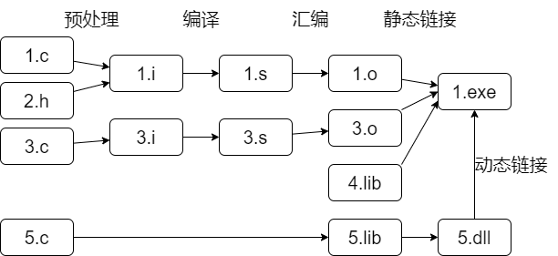

# C语言

## 编译(gcc)



```shell
gcc hello.c -o hello.exe
```

|后缀|描述|后缀|描述|
|-|-|-|-|
|`.c`|C源文件|`.s/.S`|汇编语言源文件|
|`.C/.cc/.cxx/.cpp`|C++源文件|`.o/.obj`|目标文件|
| `.h`               | 头文件           |`.a/.lib`|静态库|
|`.i/.ii`|预处理过的源文件|`.so/.dll`|动态库|

### 多文件项目

|关键字|生命周期|作用域|
|-|-|-|
|extern|静态（程序结束后释放）(栈区)|整个程序|
|static|静态（程序结束后释放）(栈区)|单个源文件|
|auto,register|函数调用（调用结束后释放）(静态数据区)|无|

#### 编译

```c
// File a.c
#include <stdio.h>
int add(int, int);
int main(void){
  printf("%d\n",add(2,3));
}
```

```c
// File b.c
int add(int x, int y) {
  return x + y;
}
```

```shell
gcc -o foo a.c b.c
gcc -o foo.exe *.c	#更省事的写法
```

#### 头文件

使用`.h`文件，复用函数原型
设置条件判断宏，以避免重复加载

```c
// File bar.h
#ifndef BAR_H
  #define BAR_H
  int add(int, int);
#endif
```

在`a.c`中添加

```c
#include "bar.h"
```

`b.c`里面也可以加载这个头文件，这样可以让编译器验证，函数原型与函数定义是否一致

编译命令不变

#### 静态链接库

用ar将目标文件变成库(后缀是`.a`还是`.lib`都可以)
然后进行静态链接(`-L`指定libmylib.a的位置)

```bash
gcc -c mylib.c -o mylib.o
ar -rc libmylib.a mylib.o
gcc main.c -o 1.exe -lmylib -L.
```

#### 动态链接库(静态调用)

```shell
gcc -c mylib.c -o mylib.o -fPIC
gcc -o mylib.dll mylib.o -shared
gcc main.c -o 2.exe -lmylib -L.
```

然后把`2.exe`和`mylib.dll`放在同一目录下即可，修改dll时无需重新编译exe

`nm`可以查看当前 .lib 文件内都有哪些符号（函数名）  

### 其他编译选项

|选项|解释|选项|解释|
|-|-|-|-|
|`-o <file>`|指定输出文件|`-I`|指定头文件的包含路径|
| `-std=c99`| 指定要用的语言标准|`-L`|指定链接库的包含路径|
|`-E`|预处理后停止|`-shared`|创建共享库/动态库|
|`-S`|编译后停止|`-static`|使用静态链接|
|`-c`|汇编后停止|`--help`|显示帮助信息|
|`-pie`|创建动态链接、位置无关的可执行文件|`--version`|显示编译器版本信息|
|`-fexec-charset=GBK`|以GBK输出|`-finput-charset=UTF-8`|以UTF-8处理源文件|
|`-g`|产生调试信息|`-O2`|优化可执行代码|
| `-v`| 显示编译的每个阶段使用的命令|`-###`|与 -v 类似，但引用的选项和命令不执行|
|`-pass-exit-codes`|从一个阶段以最高错误代码退出|`-Wa,<options>`|将逗号分隔的`<options>`传递给汇编器|
|`--target-help`|显示特定于目标的命令行选项|`-Wp,<options>`|将逗号分隔的`<options>`传递给预处理器|
| `-dumpmachine`| 显示编译器的目标处理器|`-Wl,<options>`|将逗号分隔的`<options>`传递给链接器|
| `-print-search-dirs`| 显示编译器搜索路径中的目录|`-Xassembler <arg>`|将`<arg>`传递给汇编器|
| `-print-libgcc-file-name` | 显示编译器配套库的名称|`-Xpreprocessor <arg>`|将`<arg>`传递给预处理器|
| `-pipe`| 使用管道而不是中间文件|`-Xlinker <arg>`|将`<arg>`传递给链接器|
| `-time`| 为每个子流程的执行计时|`-save-temps`|不用删除中间文件|
| `-specs=<file>`| 使用`<file>`的内容覆盖内置规范|`-save-temps=<arg>`|不用删除指定的中间文件|
| `--sysroot=<directory>`| 使用`<directory>`作为头文件和库的根目录 |`-no-canonical-prefixes`|构建其他 gcc 组件的相对前缀时，不规范化路径|
| `-B <directory>`| 将`<directory>`添加到编译器的搜索路径|||

## 常用数据

### 时间复杂度

| 复杂度 | 最大 | 复杂度 | 最大 |
| ----- | ----- | ----- | ----- |
| $\log N$| >>1e20 | $N^2$  | 6000 |
| $\sqrt N$ | 1e14 | $N^3$  | 500  |
| $N$ | 5e7 | $2^N$ | 25 |
| $N \log N$| 1e6 | $N!$  | 11 |

### 数组大小

|情形|数组大小|
|-|-|
|windows|5e8|
|128MB|3e7|

### 类型

|类型|max|approx|字节数|
|-|-|-|-|
|char|127|1.2e2|1|
|short|32767|3.2e5|2|
|unsigned short|65535|6.5e5|2|
|int、long|2147483647|2.1e9|4|
|unsigned int|4294967295|4.2e9|4|
|long long|9223372036854775807|9.2e18|8|
|unsigned long long|1844674407370955161|1.8e19|8|
|float| 2^128|3.40e38|4|
|double| 2^1024|1.79e308|8|
|void*(指针)|||8|

### 运算符优先级

|级别|运算符|级别|运算符|
|-|-|-|-|
|1|[ ]、()函数调用、->、.成员访问、i++、i--|9|&|
|2|++i、--i、&地址、*取值、+正、-负、~、!、sizeof|10|∧|
|3|强制类型转换|11|\||
|4|*乘、/除、%求余|12|&&|
|5|+加、-减|13|\|\||
|6|<<、>>|14|? :|
|7|<、<=、>、>=|15|=|
|8|==、!=|16|,|

## memset

高维数组用法不变，只要给出总个数

```c
memset(a,0,sizeof(a));
```

## 文件操作

```c
//单个文件：
freopen("in.txt","r",stdin);
freopen("out.txt","w",stdout);
//多个文件：
FILE* out=fopen("out.txt","w");//返回指针，失败NULL
fflush(FILE*);//清空缓存区
fclose(FILE*);//成功返0，失败返EOF。会先fflush
feof(FILE*);//结尾返非0，还有就返0
fgetc(),fputc(),fgets(),fputs(),fscanf(),fprintf();//第一个参数为FILE*即可
//块存储：
fread(void*,size_t size,size_t num,FILE*);//返回读入的元素个数
fwrite(void*,size_t size,size_t num,FILE*);
//文件随机访问：
fseek(FILE*,long step,int origin);//移动FILE*指向
rewind(FILE*);//移至开头
ftell(FILE*);//当前位置
//出错检测
ferror(FILE*);//正常返非0，出错返0
clearerr(FILE*);//错误标志归零（rewind、输入输出也可以）
```
| 常量     | 值   | 含义       |
| -------- | ---- | ---------- |
| SEEK_SET | 0    | 从前往后   |
| SEEK_CUR | 1    | 从当前往后 |
| SEEK_END | 2    | 从后往前   |

## main的参数

```c
main(int argc, char* argv[])
//argv[]={"str1","str2"}
```
## 环境变量 (stdlib.h)

```c
#include <stdlib.h>
getenv("HOME");
```

## typedef数组

```c
typedef char Name[20];
Name a,b;
//same as
char a[20],b[20];
```

## 位域

```c
struct Bit{
	unsigned a:2;
	unsigned  :2;//占位，跳过2位
	unsigned  :0;//占位，填满当前字节
};
```

## 可变参数 (stdarg.h)

声明函数时，末尾用省略号`...`表示可变数量的参数

```c
int printf(const char* format, ...);
```

头文件`stdarg.h`定义了一些宏，可以操作可变参数。

1. `va_list`：数据类型，定义一个可变参数对象。它必须在操作可变参数时，首先使用。
2. `va_start`：函数，初始化可变参数对象。接受两个参数，第一个是可变参数对象，第二个是原始函数里面，可变参数之前的那个参数，用来为可变参数定位。
3. `va_arg`：函数，取出当前那个可变参数，每次调用后，内部指针就会指向下一个可变参数。接受两个参数，第一个是可变参数对象，第二个是当前可变参数的类型。
4. `va_end`：函数，清理可变参数对象。

```c
double average(int i, ...) {
  double total = 0;
  va_list ap;
  va_start(ap, i);
  for (int j = 1; j <= i; ++j) {
    total += va_arg(ap, double);
  }
  va_end(ap);
  return total / i;
}
```

示例中，`va_list ap`定义`ap`为可变参数对象，`va_start(ap, i)`将参数`i`后面的参数统一放入`ap`，`va_arg(ap, double)`用来从`ap`依次取出一个参数，并且指定该参数为 double 类型，`va_end(ap)`用来清理可变参数对象。

# C++

## 杂项

### cin/cout提速

```cpp
ios::sync_with_stdio(false);
cin.tie(0);
```

### 引用

```cpp
int&a=b;
```

### 重载函数

同名不同参数

### 缺省参数

注意重载和缺省同时用时，可能产生二义性，编译出错

### 类型推导

```cpp
auto j=i;
decltype(i) j;
```


## 动态内存分配

```cpp
int*a=new int;
int*b=new int[10];
delete a;
delete[]b;
```

## 类的定义

如果先声明后定义，格式如下

```cpp
class A{
public:
    int b();
    int c(int);
};
int A::b()
{return 0;}
int A::c(int n)
{return n;}
```

成员有3种访问范围：

1. public
2. private
3. protected

不加关键字，就默认private

可以访问同类其他对象的private成员

```cpp
class A{
private:
    int n;
public:
    void setn(int t){n=t;}
    void avg(A&b,A&c){n=(b.n+c.n)/2;}
    void out(){cout<<n;}
};
A d,e,f;
d.setn(1);e.setn(3);
f.avg(d,e);
f.out();
```

### 构造函数(初始化)

同名函数。如：

```cpp
class A{
    int t;
public:
    A();
};
A::A()
{t=n;}
```

可以直接用初始化列表：

```cpp
class A{
    int t;
public:
    A(int n):t(n){};//对t用构造函数
};
```

如果构造函数有参数，新建对象时就必须带参数

```cpp
A a(2);
A b[2]={2,3};
A* p=new A(4);
```

构造函数可以重载

数组可以这样初始化：

```cpp
class A{
public:
    A(int n){}
    A(int n,int m){}
}
A arr[2]={1,A(2,3)};
```

### 复制构造函数

默认就是简单复制，可以自定义覆盖

建议(不一定)用常量，必须是引用

```cpp
A::A(const A&a);
```

调用：

```cpp
A a;
A b(a);//初始化
A c=a;//初始化
void fun(A n){}
fun(a);//作函数参数
void betterFun(const A& n){}//为避免复制开销，可以引用
A fun2(){
    A d;
    return d;//作返回值
}
A f;
f=a;//不调用复制构造函数，就是简单复制
```

g++会优化程序，可能会跳过复制构造函数

### 类型转换构造函数

一个参数的构造函数.赋值时会新建一个临时对象,再复制.

```cpp
A::A(int n);
A b=1;	//调用构造函数
b=2;	//调用类型转换构造函数
```

### 析构函数

销毁对象,释放动态内存分配的空间.变量如果不是`new`出来的会自动回收.

```cpp
class A{
    int *p;
public:
    A() {p=new int[10];}
    ~A(){delete[]p;}
}
```

### 返回值为对象的函数

return时，先调用复制构造函数，生成临时对象。

函数较简单时gcc会优化，不复制

### 静态变量、函数

本质是全局变量/函数。所有同类对象共用.定义时便实例化。

必须在所有函数外初始化

占用空间不算在sizeof里

静态函数不实例化便可用(空指针、类名::函数名、对象名.函数名).不能调用非静态函数、变量、this指针.

### 封闭类

定义：有成员对象的类

先执行成员变量的构造函数。执行次序取决于声明次序（而不是初始化列表次序）

### 常量

#### 常量对象

对象的值不能改变

#### 常量成员函数

在函数声明的**后面**加const

```cpp
void Class::f() const{}
```

不能修改所作用的对象

不能调用非常量的成员函数

可以与非常量成员函数重载。调用时取决于是否为常量对象

### 友元(函数/类)

不是成员函数、成员类，但可以访问该类型私有成员

```cpp
class C{
private:
    int t;
	friend void f(C obj);
}
void f(C &obj){obj.t++;}
```

友元关系不传递，不继承

# STL

## sort (algorithm)

```cpp
sort(a+n1,a+n2);//from a[n1] to a[n2-1]
```

## 比较函数

现成的

| 名称          | 功能描述 |
| ------------- | -------- |
| equal_to      | 相等     |
| not_equal_to  | 不相等   |
| less          | 小于     |
| greater       | 大于     |
| less_equal    | 小于等于 |
| greater_equal | 大于等于 |

```cpp
sort(a,a+n,greater<int>());
```

仿函数

```cpp
struct cmp{
    bool operator()(const T & a, const T & b)const{
        return a.b<b.b;
    }
};
sort(a,a+n,cmp());
```

函数指针

```cpp
bool cmp(const T&a,const T&b)
{return a.b<b.b;}
sort(a,a+n,cmp);
```

重载小于号(不用定义比较函数)

```cpp
struct node{
	int key,value;
	bool operator<(const node&b)const
	{return key<b.key;}
}
sort(a,a+n);
```


## 全排列 (algorithm)

```cpp
next_permutation(begin,end,cmp);
prev_permutation(begin,end,cmp);
```

返回值为bool类型，失败为false

### int

```cpp
int a[]={1,2,3,4,5};
next_permutation(a,a+5);
```

### string

```cpp
string s="abcde";
next_permutation(s.begin(),s.end());
```

## 二分查找 (algorithm)

```cpp
binary_search(a+n1,a+n2,value,cmp());//ture(找到)
//"找到"是指a<value||a>value ==false
```
```cpp
T* lower_bound(a+n1,a+n2,value,cmp());//返回值指向第一个>=value的元素，找不到就指向a[n2]
// 1    3    3    3    5
//a[0] a[1] a[2] a[3] a[4]
//假如搜索3,返回值指向a[1]
//假如搜索4,返回值指向a[4]
```

```cpp
T* upper_bound(a+n1,a+n2,value,cmp());//返回值指向第一个>value的元素，找不到就指向a[n2]
//在上一个案例中，假如搜索3,返回值指向a[4]
```

## pair模板

```cpp
pair<T1,T2>;
//same as
struct{
    T1 first;
    T2 second;
};
```

```cpp
p=make_pair(a,b);
//same as
struct{
    T1 first;
    T2 second;
}p;
p.first=a;
p.second=b;
```

## 定长数组 (array)

类似C风格数组，长度为常量表达式

```c++
array<int,5> a{};//初始化，不填的补0
a.fill(val);	//赋值给每个元素
a.data();		//指向首元素的指针
a.begin(); a.rbegin();//迭代器
a.front(); a.back();  //引用
```

## 变长数组 (vector)

作函数参数时，必须用引用

```cpp
vector<int> v;
vector<int> vv(maxSize,defaultValue);
vector<int>::iterator it;

int a[]={1,2,3,4,5};
vector<int> va(a+2,a+4);
```

增


```cpp
v.push_back(a);
v.insert(v.begin()+2,a);
```

删

```cpp
v.erase(v.begin()+2);
v.erase(v.begin()+2,v.begin()+4);
v.pop_back()
v.clear();
```

查

```cpp
v.size();//个数
cout<< v[1] <<endl;
for(it=v.begin();it!=v.end();it++)
    cout<<*it<<endl;
```

改 (algorithm)

```cpp
reverse(v.begin(),v.end());
sort(v.begin(),v.end());
```

## 平衡二叉树 (set)

### multiset (可以重复)

```cpp
multiset<int> a;
multiset<int,cmp> a;//自定义排序规则
multiset<int>::iterator i;//迭代器
```
增
```cpp
a.insert(in);
```
顺序读取
```cpp
for(i=a.begin();i!=a.end();i++)
//不可比较大小、加减(只可++/--).end()指向最后元素的后面
    cout<<*i<<",";	//类似指针
```
查
```cpp
i=a.find(value);//返回迭代器，找不到就返回a.end()
i=a.lower_bound(value);//i前面的元素都在value前面
i=a.upper_bound(value);//i及其后面的元素都在value后面
```
删
```cpp
a.erase(i);
```

### set (集合,不重复)

```cpp
set<int> a;
pair<set<int>::iterator, bool> result=a.insert(in);
//result.second表示插入是否成功
a.size();//个数
```

## 映射 (map)

### multimap

元素类型为pair<T1,T2>,T1 first为键,T2 second为值.按first排序

```cpp
multimap<T1,T2> a;
```

与multiset一样,有begin、end、insert、find、lower_bound、upper_bound函数，有迭代器

### map (不能重复)

```cpp
map<string,int> m;
m.insert(make_pair("alice",89));
cout<<m["Alice"];//可以直接把first当下标,结果是second
m["Bob"]=98;//可以读也可以写
```

类似set,insert()有返回值,其.second表明是否成功

## 优先队列 (queue)

```cpp
priority_queue <int,vector<int>,greater<int> > q;//无需#include<vector>
q.size();	//元素个数
q.empty();	//是否为空，空则返回1，否则返回0
q.push(k);	//插入k
q.pop();	//删掉第一个元素
q.top();	//返回第一个元素
```

## 双端队列 (deque)

```cpp
deque<int> d;
deque<int> d(10,5);//初始10个5
int a[]={1,2,3};
deque<int> d(a,a+3);
d.size();
d.front();		//第一个元素的引用
d.back();		//最后一个元素的引用
d.push_front();	//头部添加元素
d.pop_front();	//移除头部元素
```

## 双向链表(list)

初始化

```cpp
 list<int> l;
 list<int> l(10);	//十个元素,默认为0
 list<int> l(10,4);	//十个元素,默认为4
```

插入

```cpp
  l.push_back(10);	//尾部插入
  l.push_front(11);	//首部插入
  l.insert(it,8);	//在迭代器的位置插入新元素(不会覆盖)
```

遍历

```cpp
 list<int>::iterator it;
 for(it=l.begin();it!=l.end();it++);
 //反向遍历
 list<int>::reverse_iterator rit;
 for(rit=l.rbegin();rit!=l.rend();rit++);
```

